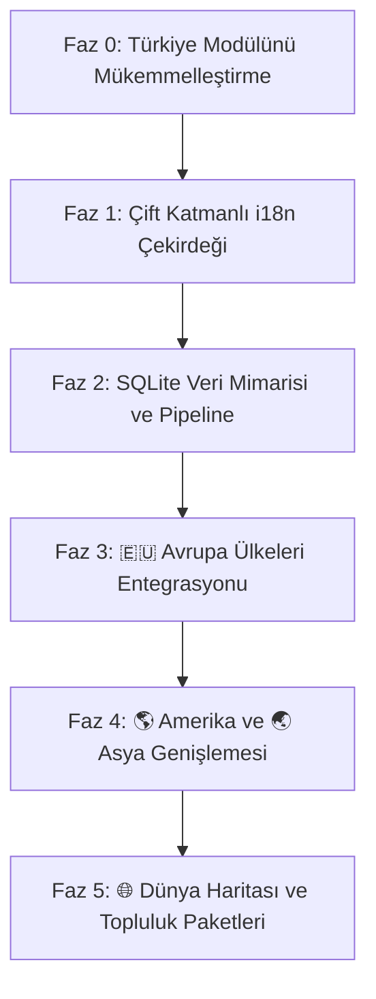

# 🌍 Globalleşme, i18n ve Veritabanı Yol Haritası (Master Plan)

Bu strateji belgesi, **Coğrafya Harita Lab** platformunun yerel bir sınav aracından (KPSS/YKS) uluslararası ölçekte çok dilli ve çok ülkeli bir **Küresel Coğrafya Platformuna (GeoMaster / GeoAtlas)** dönüştürülmesi için hazırlanan uzun vadeli geliştirme planıdır.

---

## 🧭 Temel Vizyon ve Faz Sıralaması



---

## 📍 FAZ 0: 🇹🇷 Türkiye Modülünün Finalize Edilmesi (Altın Standart)

Globalleşmeye geçmeden önce, mevcut Türkiye modülü gelecekte eklenecek tüm ülkeler için **"Referans Tasarım (Blueprint)"** haline getirilmelidir:

1. **Veri Şemasının Standartlaştırılması:**
   - Her coğrafi şekil için koordinat hassasiyeti, Haversine zorluk katsayısı, oluşum tipleri ve bilgi kartı formatı dondurulmalıdır.
2. **Kalan Eksik Katmanların Tamamlanması:**
   - Fiziki coğrafyaya ek olarak Beşeri/Ekonomik katmanlar (Madenler, Sanayi Tesisleri, İklim ve Bitki Örtüsü Kuşakları, Turizm Noktaları) tamamlanmalıdır.
3. **Kullanıcı Geri Bildirimi & UX Stabilizasyonu:**
   - Dilsiz harita, oyun modları ve serbest çizim motoru tamamen pürüzsüzleştirilmelidir.

---

## 🌐 FAZ 1: Çift Katmanlı i18n (Uluslararasılaştırma) Çekirdeği

Sistemde dil desteği iki bağımsız katmanda yönetilecektir:

### 1. Arayüz Dili (UI Strings)
- Butonlar, modallar, oyun yönergeleri ve bildirimler için JSON tabanlı çeviri tabloları (`locales/tr.json`, `locales/en.json`, `locales/de.json`, `locales/fr.json` vb.).
- Tarayıcı dilini otomatik algılama ve tek tıkla dil değiştirme (Header Language Switcher).

### 2. Coğrafi Veri Dili (Data Entity Translation)
- Her coğrafi varlığın hem **Yerel Adı** hem de **Uluslararası / İngilizce Adı** olacaktır:
  - *Örnek:* `Ağrı Dağı` (TR) ⟷ `Mount Ararat` (EN)
  - *Örnek:* `Zugspitze` (DE) ⟷ `Zugspitze Peak` (EN) ⟷ `Zugspitze Dağı` (TR)
- **Harita Katmanı i18n:** Leaflet üzerinde yerel dilde ve İngilizce etiketli harita servisleri (CartoDB Positron Multilingual / OSM / Mapbox).

---

## 🗄️ FAZ 2: SQLite Veri Mimarisi & Dağıtım Modeli

Tüm ülkelerin on binlerce coğrafi verisini yönetmek, kategorize etmek ve çoklu dilde sunmak için **SQLite** en temiz, en hafif ve taşınabilir çözümdür.

### 📊 SQLite Veritabanı Şeması Tasarımı

```sql
-- 1. Ülkeler Tablosu
CREATE TABLE countries (
    id TEXT PRIMARY KEY,            -- 'tr', 'de', 'fr', 'us', 'jp'
    code TEXT NOT NULL UNIQUE,      -- 'TUR', 'DEU', 'FRA'
    default_lat REAL NOT NULL,      -- Merkez Enlem
    default_lng REAL NOT NULL,      -- Merkez Boylam
    default_zoom INTEGER NOT NULL,  -- Başlangıç Zoom Seviyesi
    bounding_box TEXT               -- Sınır Koordinatları
);

-- 2. Ana ve Alt Kategoriler
CREATE TABLE categories (
    id TEXT PRIMARY KEY,            -- 'mountains', 'plains', 'rivers', 'lakes'
    icon TEXT NOT NULL
);

CREATE TABLE sub_categories (
    id TEXT PRIMARY KEY,            -- 'volcanic_mountains', 'fault_mountains'
    category_id TEXT REFERENCES categories(id)
);

-- 3. Coğrafi Varlıklar (Konum & Geometri)
CREATE TABLE geographic_entities (
    id TEXT PRIMARY KEY,
    country_id TEXT REFERENCES countries(id),
    sub_category_id TEXT REFERENCES sub_categories(id),
    geometry_type TEXT NOT NULL,    -- 'Point', 'Polyline', 'Polygon'
    coordinates TEXT NOT NULL,      -- JSON Koordinat Dizisi
    difficulty_level INTEGER DEFAULT 1
);

-- 4. Çoklu Dil Çeviri Tablosu
CREATE TABLE entity_translations (
    id INTEGER PRIMARY KEY AUTOINCREMENT,
    entity_id TEXT REFERENCES geographic_entities(id),
    lang_code TEXT NOT NULL,        -- 'tr', 'en', 'de', 'fr', 'es'
    name TEXT NOT NULL,
    formation_type TEXT,            -- 'Kıvrım Dağı' / 'Fold Mountain'
    info_card TEXT,                 -- Hap Bilgi / Sınav Notu
    fun_facts TEXT
);
```

### ⚡ Dağıtım Stratejisi (Architecture Choice)
- **Zero-Cost & Ultra Fast (Static Pipeline):** SQLite veritabanı lokalde/geliştirme aşamasında master veri kaynağı olarak kullanılır. Bir Python derleyici betiği (`build_dataset.py`), SQLite'tan seçili ülke ve dil paketlerini `data/countries/de_en.json` şeklinde optimize statik JSON'lara derler.
- **Sonuç:** Vercel üzerinde sunucu masrafı olmadan, 0 milisaniye gecikmeyle statik CDN üzerinden ışık hızında çalışır.

---

## 🇪🇺 FAZ 3: Avrupa Ülkeleri Genişlemesi (1. Dalga)

Avrupa, coğrafi eğitim ve sınav standartlarının yüksek olduğu öncelikli bölgedir:

1. **🇩🇪 Almanya (DACH Bölgesi):**
   - Bavyera Alpleri, Kara Orman (Schwarzwald), Ren & Elbe Nehirleri, Kuzey Almanya Ovaları.
   - Sınav odağı: *Abitur Coğrafya* müfredatı.
2. **🇫🇷 Fransa:**
   - Alpler, Pireneler, Massif Central, Sen ve Ren Nehirleri, Rhone Vadisi.
   - Sınav odağı: *Baccalauréat*.
3. **🇮🇹 İtalya:**
   - Apenin Dağları, Vezüv & Etna Volkanları, Po Ovası, Adriyatik Kıyıları.
4. **🇬🇧 Birleşik Krallık & 🇪🇸 İspanya:**
   - Highlands, Pennines, Thames / Sierra Nevada, Ebro ve Guadalquivir Havzaları.

---

## 🌎 FAZ 4: Amerika & Asya Genişlemesi (2. Dalga)

1. **🇺🇸 Amerika Birleşik Devletleri:**
   - Kayalık Dağlar (Rocky Mountains), Apalaşlar, Mississippi-Missouri Havzası, Büyük Kanyon, Büyük Göller Bölgesi, San Andreas Fay Hattı.
2. **🇯🇵 Japonya:**
   - Fuji Dağı, Pasifik Ateş Çemberi Fay Hatları, Japon Alpleri, Ada Coğrafyası.
3. **🇨🇳 Çin & 🇮🇳 Hindistan:**
   - Himalaya Sıradağları, Tibet Platosu, Yangtze & Sarı Irmak, Ganj & İndus Havzaları.

---

## 🏆 FAZ 5: Küresel Özellikler & Topluluk

1. **🌐 "Dünya Modu" (World Explorer):**
   - Tek bir ülke yerine tüm kıtaları kapsayan "Dünya Dağları", "Dünya Boğazları/Kanalları" (Süveyş, Panama, Malakka vb.) küresel turnuvaları.
2. **📦 Topluluk Harita Paketleri (User Decks):**
   - Kullanıcıların kendi ülkeleri/üniversiteleri için hazırladıkları JSON harita paketlerini yükleyip paylaşabilecekleri açık ekosistem.
